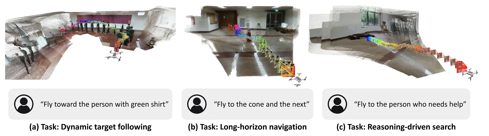

<div align="center">
<h1>See, Point, Fly: A Learning-Free VLM Framework for Universal Unmanned Aerial Navigation</h1>

[**Chih Yao Hu**](https://hu-chih-yao.vercel.app)<sup>2*</sup>&emsp;
[**Yang-Sen Lin**](https://www.linkedin.com/in/yang-sen-lin/)<sup>1*</sup>&emsp;
[**Yuna Lee**](https://yuna0x0.com)<sup>1</sup>&emsp;
[**Chih-Hai Su**](https://su-terry.github.io)<sup>1</sup>&emsp;
[**Jie-Ying Lee**](https://jayinnn.dev)<sup>1</sup>&emsp;
<br>
[**Shr-Ruei Tsai**](https://openreview.net/profile?id=~Shr-Ruei_Tsai1)<sup>1</sup>&emsp;
[**Chin-Yang Lin**](https://linjohnss.github.io)<sup>1</sup>&emsp;
[**Kuan-Wen Chen**](https://openreview.net/profile?id=~Kuan-Wen_Chen2)<sup>1</sup>&emsp;
[**Tsung-Wei Ke**](https://twke18.github.io)<sup>2</sup>&emsp;
[**Yu-Lun Liu**](https://yulunalexliu.github.io)<sup>1</sup>&emsp;

<sup>1</sup>National Yang Ming Chiao Tung University&emsp;&emsp;&emsp;<sup>2</sup>National Taiwan University
<br>
*Indicates Equal Contribution

**CoRL 2025**

<a href='https://spf-web.pages.dev'></a>
<a href="https://arxiv.org/abs/2509.22653"></a>
<a href="https://openreview.net/forum?id=AE299O0tph"></a>
<a href='https://spf-web.pages.dev'></a>
</div>

**Zero-shot language-guided UAV control.** See, Point, Fly (SPF) enables UAVs to navigate to any goal based on free-form natural language instructions in any environment, without task-specific training. The system demonstrates robust performance across diverse scenarios including obstacle avoidance, long-horizon planning, and dynamic target following.



## Requirements
- uv (Python package manager)
- Python 3.13+
- Google Gemini API key or OpenAI-compatible API key
- DJI Tello drone (for real-world testing in `tello` mode)
- DRL Simulator (for simulation testing in `sim` mode)

## Installation
1. Make sure **uv** is installed. If not, follow the instructions at [uv docs](https://docs.astral.sh/uv/getting-started/installation/).

2. Make sure **Python 3.13** is installed. If not, run the following command to install it via uv:
```bash
uv python install 3.13
```

3. Clone this repository and navigate to the project directory:
```bash
git clone https://github.com/Hu-chih-yao/see-point-fly.git
cd see-point-fly
```

4. Sync the project dependencies and activate the virtual environment:
```bash
uv sync
source .venv/bin/activate
```

5. Test the installation by running:
```bash
spf --help
```

6. Follow the steps in the next section to set up the environment variables and configuration files.
After setting up, you can start the system in either `tello` or `sim` mode:
```bash
# Start in tello mode
spf tello

# Start in simulator mode
spf sim
```

## Environment Variables Setup
Copy the `env.example` file to `.env` and fill in the required API keys, you only need to provide the key of provider you want to use (either Gemini or OpenAI compatible):
```bash
# Gemini API Configuration
GEMINI_API_KEY=your_gemini_api_key_here

# OpenAI compatible API Configuration
OPENAI_API_KEY=your_openai_api_key_here
OPENAI_BASE_URL=https://example.com/api/v1
```

## Configuration

There are two modes (`tello` and `sim`) available in this project. You can switch between them in the command line when starting the system.

Each mode has its own configuration file (`config_tello.yaml` and `config_sim.yaml`).

### A. Tello Mode Configuration
Update `config_tello.yaml` as needed:
```yaml
# Tello Drone Configuration
# This file controls the operational mode and behavior of the Tello drone system

# API Provider Configuration
# Choose between "gemini" or "openai" (OpenAI compatible API)
api_provider: "gemini" # or "openai"

# Model Configuration
# Specify the exact model name to use (overrides operational_mode defaults)
# Leave empty to use operational_mode defaults
model_name: "" # e.g., "gemini-2.5-flash", "gemini-2.5-pro", "openai/gpt-4.1"

# Operational Mode Configuration
# adaptive_mode: Original version with depth estimation and adaptive navigation
# obstacle_mode: Enhanced version with obstacle detection and intensive keepalive
operational_mode: "adaptive_mode" # Change to "obstacle_mode" for enhanced obstacle detection
#operational_mode: "obstacle_mode"

# Processing Configuration
command_loop_delay: 2 # Delay in seconds between processing cycles
```

#### Tello Mode Selection Guide

| Mode | Best For | Default AI Model | Safety Features |
|------|----------|------------------|-----------------|
| `adaptive_mode` | Indoor precision tasks | Gemini 2.5 Flash | Standard error handling |
| `obstacle_mode` | Complex environments | Gemini 2.5 Pro | Enhanced safety + obstacle detection |

### B. Simulator Mode Configuration

Simulator mode uses the **Gemini 2.5 Flash** model by default, but you can specify a different model if desired.

Update `config_sim.yaml` as needed:
```yaml
# Simulator Navigation Configuration

# API Provider Configuration
# Choose between "gemini" or "openai" (OpenAI compatible API)
api_provider: "gemini" # or "openai"

# Model Configuration
# Specify the exact model name to use
# Leave empty to use default model for the provider
model_name: "" # e.g., "gemini-2.5-flash", "gemini-2.5-pro", "openai/gpt-4.1"

# Navigation Mode
adaptive_mode: false # Enable adaptive depth-based movement (true/false)

# Processing Configuration
command_loop_delay: 0 # seconds between processing cycles

# Display Configuration
monitor: 1 # monitor index to capture (1=primary monitor)
```

## Additional Repositories
- [Project Page](https://github.com/yuna0x0/spf-web)
- [Supplementary Material](https://github.com/yuna0x0/spf-suppl)

## Acknowledgement
This research was funded by the [National Science and Technology Council](https://www.nstc.gov.tw/?l=en), Taiwan, under Grants NSTC 113-2628-E-A49-023- and 111-2628-E-A49-018-MY4. The authors are grateful to [Google](https://about.google), [NVIDIA](https://www.nvidia.com/en-us/), and [MediaTek Inc.](https://www.mediatek.com) for their generous donations. Yu-Lun Liu acknowledges the Yushan Young Fellow Program by the MOE in Taiwan.

## License
Read the [LICENSE](./LICENSE) file for details.

## Citation
```bibtex
@inproceedings{hu2025spf,
	title        = {See, Point, Fly: A Learning-Free VLM Framework for Universal Unmanned Aerial Navigation},
	author       = {Chih Yao Hu and Yang-Sen Lin and Yuna Lee and Chih-Hai Su and Jie-Ying Lee and Shr-Ruei Tsai and Chin-Yang Lin and Kuan-Wen Chen and Tsung-Wei Ke and Yu-Lun Liu},
	year         = 2025,
	booktitle    = {9th Annual Conference on Robot Learning},
	url          = {https://openreview.net/forum?id=AE299O0tph}
}
```
